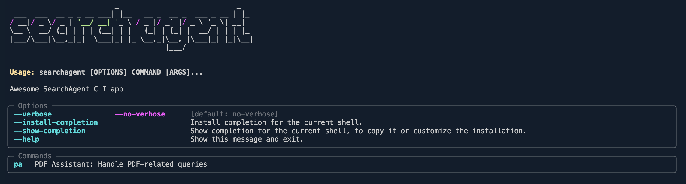
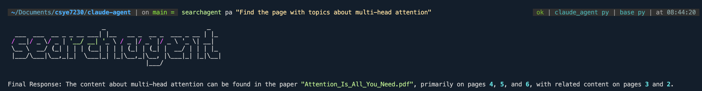
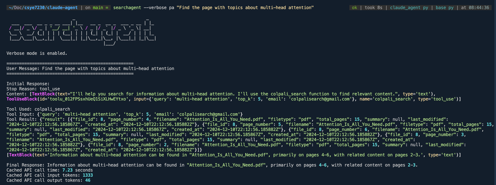
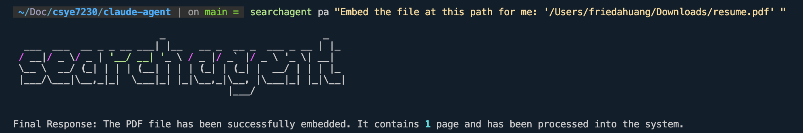

## SearchAgent

SearchAgent is a CLI tool that integrates ColPali and Claude 3.5 Sonnet for managing PDF documents, enabling users to search, embed, delete, and retrieve files through natural language.

### Quick Start

1. Install [uv](https://docs.astral.sh/uv/)

2. Install dependencies by running `uv sync`

3. Create a .env file based on `example.env`

4. Install the project by running `uv pip install .`

### Usage

**Get help**

`searchagent --help`

**Search for a page on a specific topic**

`searchagent pa "Find me a page on multi-head attention"`

**Embed a PDF file**
_Caveat: You must provide a valid file path._

`searchagent pa "Embed the paper at this path: /path/to/attention_is_all_you_need.pdf"`

**Delete a PDF file**
_Caveat: You must provide a valid file id number_

`searchagent pa "Delete a file with an id of 19"`

**Get all embedded files**
`searchagent pa "Get all embedded files"`

## Examples

1. `search pa "Find the page with topics about multi-head attention"`
   

2. `search --verbose pa "Find the page with topics about multi-head attention"` (_verbose mode_)
   

3. `searchagent pa "Embed the file at this path for me: '/Users/friedahuang/Downloads/resume.pdf' "`
   
